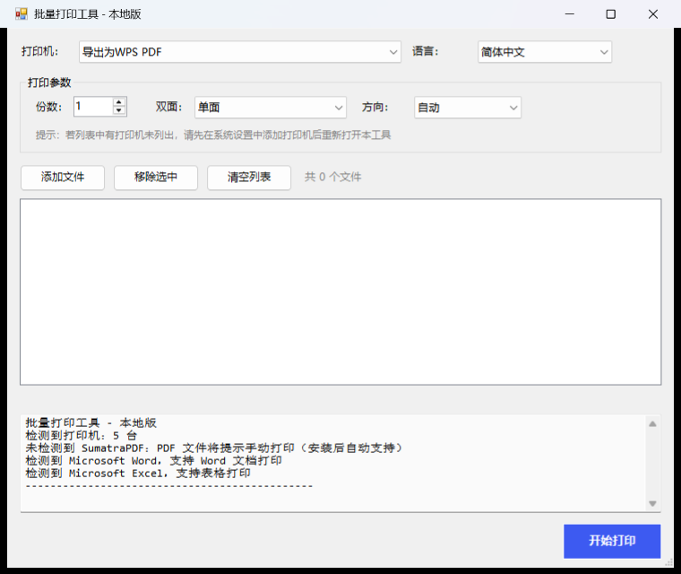
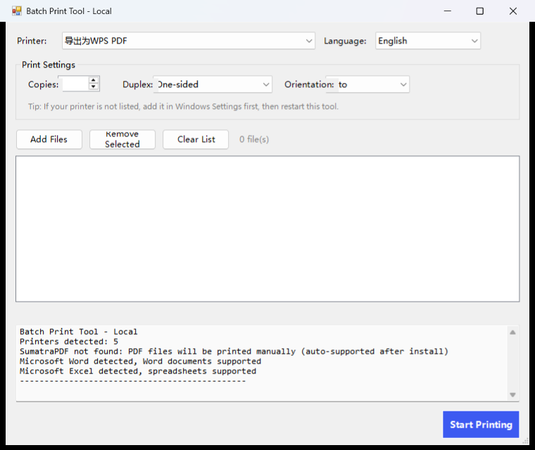

# Batch Print Tool 批量打印工具

> Windows 本地批量打印工具：一次添加多个文件，统一设置份数、单面/双面、纸张方向，逐个静默打印，全程无需逐文件确认弹窗。

## 功能特性

- **打印机自由选择**：自动枚举本机已安装的所有打印机（含网络打印机），下拉框点选即可
- **批量参数设置**：统一设置打印份数、单面 / 双面（长边翻转 / 短边翻转）、纸张方向（自动 / 纵向 / 横向），应用到全部文件
- **Word / Excel 双面真实生效**：打印前自动把打印机临时切换到你选择的双面模式，全部打完后自动恢复原设置（解决"双面设置无效、页数翻倍"问题）
- **自动方向防拆页**：方向选择"自动"时，Word/Excel 保留文档自身方向，横向表格不会被强制改成纵向而拆成两页
- **静默批量打印**：无需为每个文件点击确认
- **支持拖拽添加文件**，可多选、可移除
- **多语言界面（8 种）**：简体中文 / English / 繁體中文 / 日本語 / 한국어 / Deutsch / Français / Español，自动跟随系统语言，也可通过顶部下拉框手动切换，选择后自动记住（下次启动保持）

## 界面截图

中文界面（Simplified Chinese UI）：

英文界面（English UI）：

语言切换：顶部右侧下拉框支持 8 种语言（简体中文 / English / 繁體中文 / 日本語 / 한국어 / Deutsch / Français / Español）。首次启动自动跟随系统语言；手动切换后写入 `lang.ini`（与脚本同目录），下次启动保持。

## 支持的文件格式

| 类型 | 格式 | 打印方式 | 依赖 |
| --- | --- | --- | --- |
| 图片 | PNG / JPG / JPEG / BMP / GIF / TIFF | System.Drawing 直接打印 | 无 |
| 文本 | TXT | 分页逐行打印（UTF-8 / GBK 自动识别） | 无 |
| PDF | PDF | SumatraPDF 静默打印 | 需安装 SumatraPDF |
| Word | DOC / DOCX | Office COM 打印，自动回退 WPS | 需 Microsoft Office 或 WPS |
| Excel | XLS / XLSX | Office COM 打印，自动回退 WPS | 需 Microsoft Office 或 WPS |

> 网页版（`web/batch-print-tool.html`）受浏览器安全限制，**无法打印 Word/Excel 和 PDF**，仅作为图片/文本的轻量打印入口。完整功能请使用本地版。

## 环境要求

- Windows 7 及以上（建议 Windows 10/11）
- PowerShell 5.1（Windows 自带，无需安装）
- 打印 Word/Excel：安装 Microsoft Office 或 WPS 任一即可
- 打印 PDF（可选）：安装 [SumatraPDF](https://www.sumatrapdfreader.org/)

## 快速开始

1. 下载本项目源码（Clone 或 Download ZIP）
2. 双击 `src/start.bat`（或右键 `src/batch-print-tool.ps1` → 使用 PowerShell 运行）
3. 在顶部选择打印机
4. 设置份数、双面模式、方向（建议方向保持"自动"）
5. 点击"添加文件"（可多选，也可直接拖拽文件到列表）
6. 点击"开始打印"

## 常见问题

**为什么我打 44 页内容却出了 88 张纸？**

两个原因：一是之前版本双面设置对 Word/Excel 不生效（走打印机默认单面）；二是方向强制"纵向"把横向表格拆成两页。本工具已修复：双面通过打印机临时配置真实生效，方向默认"自动"尊重文档自身方向。

**为什么网页版打不了 Word/Excel？**

浏览器安全限制：任何网页都无法枚举打印机、也无法渲染打印 docx 文件，这是所有浏览器的通病，与工具无关。请使用本地版（双击 `src/start.bat`）。

**双击 bat 报 `The argument ... to the -File parameter does not exist`？**

旧版 bat 因中文文件名 + `chcp 65001` 导致 cmd 乱码。本包已改用纯英文脚本名 `batch-print-tool.ps1` 和纯英文 bat 内容，不会再出现。

**没有 SumatraPDF，PDF 能打吗？**

不能静默打印，工具会提示安装。也可直接右键 PDF 用浏览器手动打印。

## 技术实现

- 界面：PowerShell + WinForms（`System.Windows.Forms`、`System.Drawing.Printing`）
- 图片/文本打印：`PrintDocument` 逐页绘制
- Word/Excel 打印：`Word.Application` / `Excel.Application` COM（自动回退 WPS 的 `KWps` / `KET`）
- 双面控制：`Set-PrintConfiguration` 临时切换打印机 `DuplexingMode`（OneSided / TwoSidedLongEdge / TwoSidedShortEdge），打印完成后恢复
- 无任何第三方依赖、无需管理员权限、单文件脚本即拷即用

## License

[MIT](LICENSE)

---

**Batch Print Tool** — Batch print images, text, PDF, Word and Excel files on Windows with unified copies / duplex / orientation settings.
